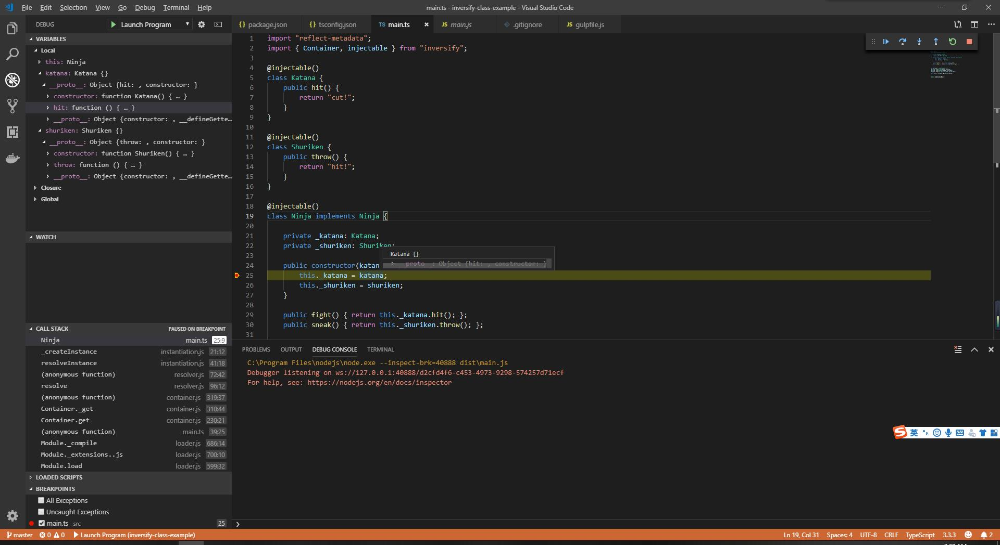
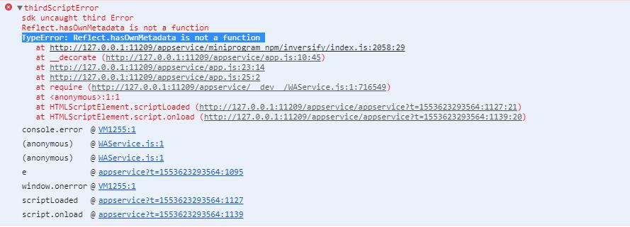

# inversify-class-example
After git clone, Run following commands:

$ npm install
$ gulp

$ node dist/main.js

Or debug in VS Code (no errors)

Some Comments:
This is a sample code for reproducing wechat mini program can't properly use InversifyJS issue. If you run this sample code in VS Code or in console, it works. However in wechat mini program dev tool, the wechat miniapp compiler reports "TypeError: Reflect.hasOwnMetadata is not a function" error as below,

